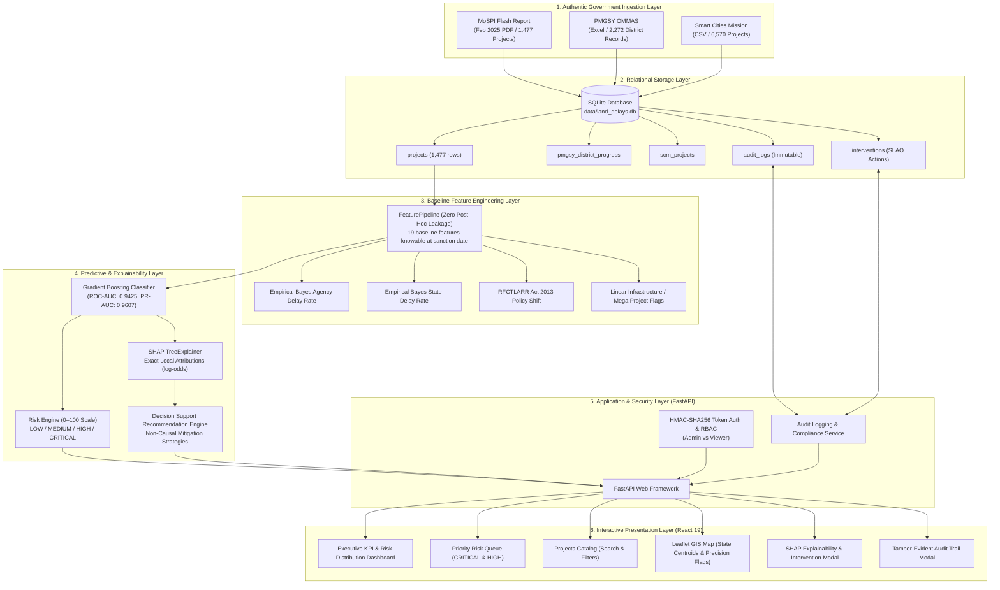

# System Architecture: SIH26017

**System:** Predictive Analytics System for Early Detection of Land Acquisition Delays  
**Authority:** Ministry of Rural Development, Government of India  
**Version:** 1.0.0 (Production Hackathon Release)

---

## 1. High-Level Architectural Diagram

---

## 2. Layer-by-Layer Architectural Breakdown

### Layer 1: Authentic Government Data Ingestion
- **MoSPI Central Sector Flash Report (Feb 2025):** 1,477 ongoing central public projects costing ₹150 Cr and above across 10 sectors (Roads, Railways, Power, Coal, Petroleum, Urban Development, etc.) parsed using PDF table extractors.
- **PMGSY OMMAS District Construction Records:** 2,272 district progress records capturing physical length sanctioned, balance works, and expenditure.
- **Smart Cities Mission (SCM) Masterdata:** 6,570 urban municipal infrastructure projects.
- **Zero-Fabrication Guarantee:** Validated via automated SHA-256 hash checks and row count verification.

### Layer 2: Relational Data Storage (SQLite WAL Mode)
- Single unified SQLite database located at `data/land_delays.db`.
- Contains normalized relational schemas:
  - `projects`: Primary central sector infrastructure project catalog.
  - `pmgsy_district_progress`: District-level rural road construction records.
  - `scm_projects`: Urban municipal project data.
  - `audit_logs`: Immutable, append-only log recording logins, parameter updates, and intervention orders.
  - `interventions`: Administrative records of District Collector and SLAO mitigation actions.

### Layer 3: Baseline Feature Engineering (Strict Zero Leakage)
To prevent retrospective bias, the pipeline strictly permits features knowable **at original government sanction date**:
1. **Planned Duration:** Months between approved sanction date and original scheduled commissioning.
2. **Log Original Cost:** Normalized project capital magnitude.
3. **Approval Vintage:** Approval year and approval month.
4. **Institutional Memory (Empirical Bayes Smoothed Delay Rates):** Historical delay tendencies for implementing agencies and states smoothed with $m$-estimate shrinkage ($m = 5$) to prevent small-sample overfitting.
5. **Regulatory Regime:** Binary indicator for approvals following the enactment of the *Right to Fair Compensation and Transparency in Land Acquisition, Rehabilitation and Resettlement (RFCTLARR) Act, 2013*.
6. **Infrastructure Characteristics:** Binary linear infrastructure flag (high RoW friction: Highways, Railways, Power corridors) and Mega-Project indicator ($\ge ₹1,000\text{ Cr}$).
7. **Sectoral Indicators:** One-hot encoded indicators for 8 major line ministries.

### Layer 4: Machine Learning & Decision Support Engine
- **Ensemble Classifier:** Scikit-learn `GradientBoostingClassifier` with shallow trees (`max_depth=3`) and moderate shrinkage (`learning_rate=0.05`) to prevent overfitting.
- **Calibrated Risk Engine:** Converts continuous probabilities into an operational 0–100 integer score mapped to discrete administrative action tiers:
  - `LOW` (0–30): Routine quarterly milestone review.
  - `MEDIUM` (31–60): Monthly line ministry monitoring.
  - `HIGH` (61–80): Fortnightly coordination committee escalation.
  - `CRITICAL` (81–100): Immediate District Collector / Special Land Acquisition Officer (SLAO) intervention.
- **Explainable AI (SHAP TreeExplainer):** Generates exact Shapley values in log-odds space for each individual project, dissecting mitigating factors versus risk-elevating drivers.
- **Decision Support Recommendation Engine:** Translates top SHAP drivers into actionable administrative directives (e.g. convening State Central Sector Projects Coordination Committee (CSPCC) reviews, auditing 3D/3G gazette notifications under CALA).

### Layer 5: Backend API & Security Layer (FastAPI)
- Lightweight REST API powered by FastAPI and Uvicorn.
- **Authentication:** Zero-dependency HMAC-SHA256 signed bearer tokens with session expiry.
- **Role-Based Access Control (RBAC):**
  - **Admin:** MoRD Executive clearance. Can view analytics, record administrative interventions, and inspect compliance audit logs.
  - **Viewer:** Public Auditor clearance. Read-only access to catalog, risk profiles, GIS map, and SHAP explainability.
- **Static Asset Serving:** Mounts pre-compiled React frontend at `/app` for single-port deployment.

### Layer 6: Frontend Presentation Layer (React 19 + Tailwind CSS v4)
- **Executive Dashboard:** Live KPI cards, risk distribution charts, and high-risk priority queue.
- **Projects Directory:** Full search, multi-sector and multi-state filtering, and pagination.
- **Geospatial GIS Map:** Leaflet OpenStreetMap interactive visualization with authentic state administrative centroids and explicit precision labeling (`State-level centroid`).
- **Interactive Project Modal:** Deep-dive into project financials, timeline trajectories, local SHAP drivers, and real-time intervention recording form.
- **Audit Trail Modal:** Real-time inspection of administrative actions and compliance history.
