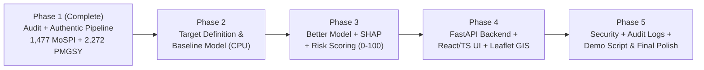

# SIH26017: High-Level Implementation Plan (Phases 2 – 5)

**Project:** Predictive Analytics System for Early Detection of Land Acquisition Delays  
**Authority:** Ministry of Rural Development, Government of India  
**Target Execution:** Free-Tier CPU / Gemini Flash Optimized  
**Governing Principle:** Never fabricate data, labels, or results. Use only authentic, traceable government records.

---

## High-Level Phase Roadmap

---

## Phase 2: Target Definition, Feature Pipeline & Baseline Model

### 1. Scientific Target Definition
- Formal definition: $\text{delay\_months} = T_{\text{anticipated}} - T_{\text{original}}$.
- Binary classification target: $y \in \{0, 1\}$ where $1 = \text{Delayed} (\text{delay\_months} > 0)$, $0 = \text{On-Time} (\le 0)$.
- Strict documentation on handling ongoing/censored projects and missing revised dates.

### 2. Leakage-Free Feature Pipeline
- **Features knowable at prediction time ONLY:**
  - Approved Project Cost ($\log(\text{orig\_cost\_cr})$)
  - Sector (One-hot / Target encoded)
  - Implementing Agency (e.g. NHAI vs MoRTH vs Railways)
  - Geographic Region / State Risk Profile
  - Planned Project Duration (months from approval to planned commissioning)
- **Strict Leakage Prevention:**
  - Never use actual completion date, anticipated completion date, cumulative expenditure velocity, or final cost overruns to predict the delay target (as those reflect post-hoc outcomes).
  - Produce automated unit tests verifying zero mutual information leakage.

### 3. Split Strategy
- Grouped split (stratified by Sector & State, grouped by Project Code) to prevent data leakage across geographic and administrative clusters (70% Train, 15% Validation, 15% Test).

### 4. Baseline Modeling & Evaluation
- Train **ONE** lightweight, interpretable baseline model (Logistic Regression with L2 regularization or Decision Tree).
- Honestly report: ROC-AUC, PR-AUC, Precision, Recall, F1-Score, and Confusion Matrix.
- Produce `MODEL_EVALUATION.md` and `LEAKAGE_REPORT.md`.

---

## Phase 3: Better Model, Explainability (SHAP) & Risk Scoring

### 1. Model Upgrade (CPU-Optimized)
- Train **ONE** stronger ensemble model (Random Forest or Gradient Boosting / XGBoost).
- Compare honestly against Phase 2 baseline; retain the superior model.
- Hyperparameter tuning kept minimal to respect CPU constraints.

### 2. SHAP Explainability Engine
- Generate TreeSHAP / KernelSHAP values:
  - Global feature importance (top factors driving delay across India).
  - Per-project local explanations: Top 3–5 risk drivers translated into plain English decision support (e.g., *"Historical agency backlog and high capital outlay contributed strongly to this prediction"* — strictly decision support, never asserting direct causation).

### 3. Transparent Risk Engine
- Map model calibrated probabilities to an intuitive 0–100 Risk Score:
  - **LOW RISK (0–30):** On schedule, minimal structural delay indicators.
  - **MEDIUM RISK (31–60):** Moderate clearance or procedural vulnerability.
  - **HIGH RISK (61–80):** Significant delay indicators; active monitoring required.
  - **CRITICAL RISK (81–100):** Acute bottleneck profile; urgent executive intervention recommended.

### 4. Documentation
- Update `MODEL_EVALUATION.md`.
- Produce `EXPLAINABILITY.md` and standard `MODEL_CARD.md`.

---

## Phase 4: Backend API, Minimal Dashboard & GIS Visualization

### 1. Lightweight FastAPI Backend
- REST API endpoints:
  - `GET /projects`: Paginated project catalog with filters (sector, state, agency, risk level).
  - `GET /projects/{id}`: Detailed project sheet with original timelines and cost metrics.
  - `GET /projects/{id}/risk`: Calibrated risk score (0–100), risk band, confidence interval.
  - `GET /projects/{id}/explanation`: Top SHAP risk drivers and contextual decision support guidance.
  - `GET /risks`: High-priority alert queue for executive oversight.
- Plain-language recommendation engine mapping top risk drivers to administrative interventions (e.g., *"Pending statutory land gazette notification — escalate CALA review"*).

### 2. Minimal React + TypeScript Frontend (Vite + Tailwind)
- **Executive KPI Dashboard:** Total monitored projects, high/critical risk count, sector breakdown chart, and priority intervention table.
- **Project Detail View:** Complete project breakdown, score badge, radar/bar chart of SHAP drivers, and decision support recommendations.
- **GIS Map (Leaflet / OpenStreetMap):**
  - Plots project locations using authentic State and District centroid coordinates.
  - Clear label denoting precision level (State/District level) — zero fabricated GPS coordinates.
  - Interactive popup displaying project name, agency, cost, and delay risk status.
- Honesty safeguard: If data for a project is insufficient, displays *"Prediction unavailable — insufficient validated data"* instead of fabricating a score.

---

## Phase 5: Security, Audit Logging, Documentation & Demo Polish

### 1. Security & Traceability
- Lightweight JWT / Session authentication for administrative access (Admin / Viewer roles).
- Append-only administrative audit log recording all user actions (e.g. intervention logged, review completed).

### 2. Comprehensive Documentation Suite
- `README.md`: System quickstart and project overview.
- `ARCHITECTURE.md`: Architecture diagrams, data flow, and tech stack specification.
- `LIMITATIONS.md`: Honest disclosure of data boundaries (e.g. missing parcel-level court dockets, macro delay mapping).
- `RESPONSIBLE_AI.md`: Ethical AI declaration (decision support only; human in the loop; correlation ≠ causation).
- `DEMO_GUIDE.md`: Step-by-step 3–5 minute judge presentation script.

### 3. Final Quality & Honesty Gate
- Codebase scan confirming zero hardcoded synthetic numbers, 100% provenance back to official government sources, and clean build/test passes.
